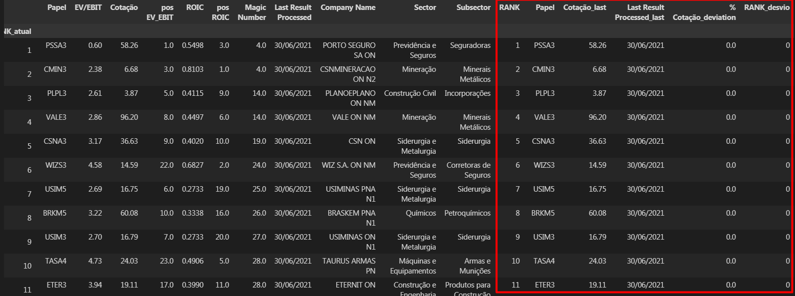

# Magic Number Ranking
### Magic Number Ranking in Python based on "Little Book that Beats the Market" by Joel Greenblatt.

#### Using Fundamentus website scrapping.
"This is not an investing recomendation"

## Update log:

### Feature applied n 1 (29 July 2021)
#### Get the last processed result date.

### Feature applied n2 (29 July 2021)
#### Add fields Company name, Sector and Subsector to ranking dataframe.

### Feature applied n3 (24 August 2021)
#### Comparison of the ranking versus the last processed ranking to gather the deviations.

